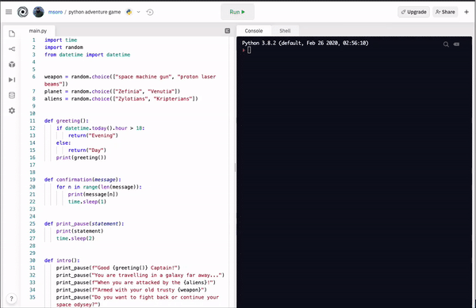
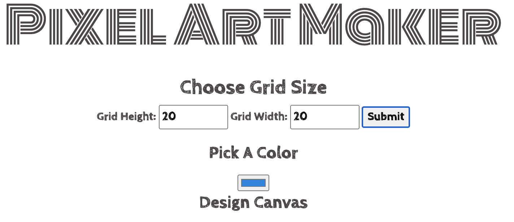
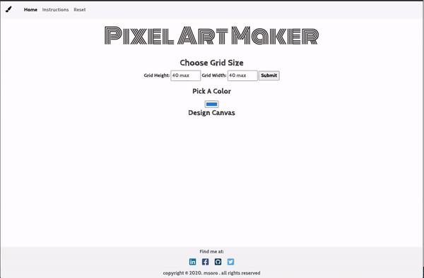

# Intro to Programming Nanodegree

This course will introduce the student to HTML, CSS, Python and Javascript. Learn about data types, functions, logical statements and conditions.

This course will also teach Version control and git.

The Final project in this course is to manipulate the DOM to create a grid of canvas that allows users to create a digital masterpiece!

### [Course Syllabus](Intro-to-programming-syllabus.pdf)

## :computer: Intro to HTML and Intro to CSS

Get introduced to HTML and CSS the building blocks of a webpage.
The project at the end of this lessons requires creating a trading card with HTML and CSS files. Learn the webpage structure and link CSS file to style the webpage.

:dart: [PROJECT - Animal Trading Cards](Animal trading cards/index.html)

>In this project, you’ll be creating a trading card for your favorite
animal. You will use your knowledge of HTML to create the structure
for your trading card. Then you will use CSS styling to design it.

## :computer: Intro to Python

Learn the fundamentals of Python programming language. Learn functions, logic checks and data structures. Plus, Version Control with git and the Command Line interface.

:dart: [PROJECT - Adventure Game](https://repl.it/@msoro/python-adventure-game#main.py)

>Create an interactive game in Python using modules, loops,
conditionals, and functions. Building this program will affirm your
understanding of Python syntax, give you practice with fundamental
programming logic, and demonstrate your ability to solve problems
with code.

## :computer: Intro to JavaScript

Learn the fundamental concepts of JavaScript. The most popular web programming language. Understand the DOM, Nodes and Elements. The course will conclude with a single page web app that allows users to create a digital pixel art masterpiece.

:dart: [PROJECT - Pixel Art Maker](https://m-soro.github.io/Pixel-Art-Maker/)

>For this project, you’ll build a single-page web app that allows users
to draw pixel art on a customizable canvas!

---

## [Certificate of Completion](https://confirm.udacity.com/HGL2D6QN)

---

**Acknowledgement**

Thanks to :raised_hands:[Udacity](https://www.udacity.com):raised_hands: for the **[free month access](free-month.jpg)** :thumbsup:.
*I studied intensely :monocle_face: to finish this course in one month!*
